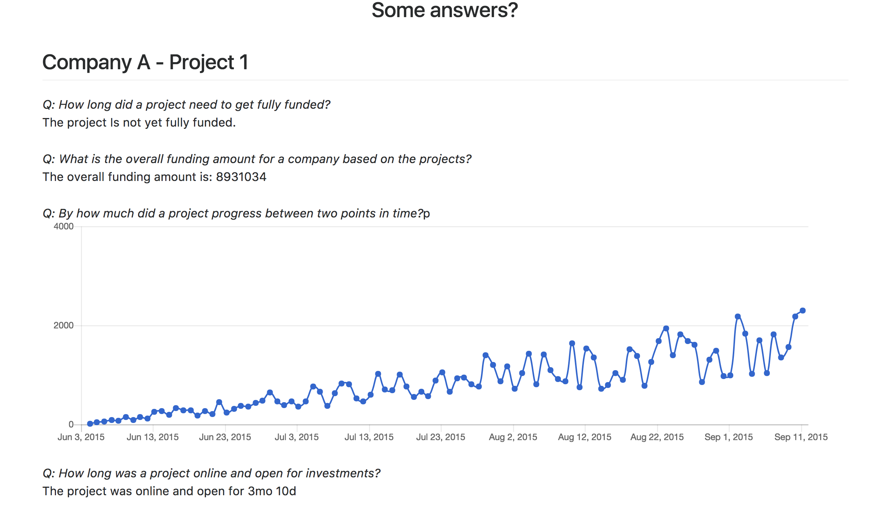

# README

This is a solution for the Project Tracker Problem.

###Tech
This is a rails app.
Uses Rails 5.1.1 with Ruby 2.4.1

###Data
You can run the rake task 
`rake seed_data:generate_data` to generate the seed data.

###Output
If you visit `localhost:300` you must see the solution.

###Screenshot
Here is a screenshot from my dev machine.

